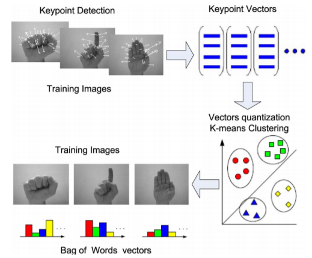
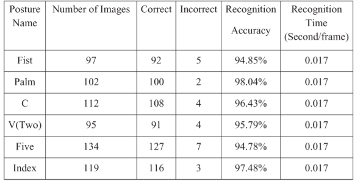

# Applied Deep Learning

### Project topic

This is a *Computer Vision* project covering the tasks of *object detection* and *object classification*.

More precisely, the project will perform hand detection and its posture classification.

### Project type

The project type will be a mixture of more categories, however, I choose the **Beat the classic** type.

The traditional approach with which I will compare my method is *Bag of Visual Words* (also called Bag of Features) paired with *SVM*.
I am interested in comparing this approach with deep learning because I have already used BoF+SVM during my university studies.

Bag of Features extract features using one of the many available methods (e.g. SIFT, SURF, ORB, ...) to build a vector representation of an object. This vector is then given as input to a classifier (like SVM or even a neural network) to detect the class of the object.

The main weakness of Bag of Features is that spatial information is completely lost.

The reference paper where this established method was applied is:  

[Real-Time Hand Gesture Detection and Recognition Using Bag-of-Features and Support Vector Machine Techniques](https://ieeexplore.ieee.org/document/5983442)

Published: 15 August 2011, just one year before AlexNet.

As BoF doesn't provide detection capabilities, they isolated hands exploiting skin-color information extracted from a face detected in the image using the Viola-Jones method. 

The metric that will be used to compare the deep-learning method with the BoF+SVM method is the *accuracy*:

# Summary

## Project idea & Approach

The project is based on the *hand detection and posture classification* task (also called static gesture recognition) with the idea of creating a simple HMI - Human to Machine Interface - that maps hand postures to user commands.

The high-level approach will use a composition of:

1. A one-stage detector to localize hands in the input image
2. A CNN network to classify the posture of a hand (e.g. fist, palm, Star Treck's Vulcan greeting)

    

The input of the classifier will be hands cropped using the bounding boxes found by the detector. 

### Application

The final application will map the hand postures found by the network to machine commands. This can be done executing system commands from the program and using a library like [xdotool](https://www.semicomplete.com/projects/xdotool/), which allows to fake keyboard/mouse input.
More precisely, I identified two possible ways to extract commands from the positions and postures of the hand:

- A simple mapping from postures to commands (e.g. horizontal 2-fingers peace sign → next slide command). 
- Positions and postures collection and time analysis: for example, opening the hand from fist to wide palm could initiate the gesture and the collection of the following hand positions until another wide palm is recognized. The intermediary fist positions could be analyzed with a simple linear regression to extract a gesture and take an action (e.g. fist moved from the bottom left to top right → 45° movement command detected → execute an action, see image below).

In both cases, detection & classification speeds (i.e. processed FPS) play an important role to make the final application usable by users who do not have specialized hardware. The implementation choices will consider this aspect.

### Network architecture details

**Hand detection**

The detection of the hands will more likely be the most difficult and expensive (in terms of computational cost) task and therefore I will spend more time trying to optimize it. 

I've chosen to use a one-stage detector over a two-stage detector.
The reason for choosing a one-stage detector rather than a two-stage detector is mainly given by the much faster inference time of the first, as it includes both the Region of Interests proposal and evaluation. However, the smaller inference time comes with a lower accuracy w.r.t. two-stage detectors.

More specifically, the following "methods" will likely be used:

- *Feature Pyramid Network* as feature extractor to be more scale-invariant without killing computation speed

- *ResNet** for the bottom-up pathway of FPN: I like the skip-connections idea to solve the degradation problem of deep networks

- The *focal loss* to deal with the class-imbalance problem
- *Anchor boxes* to better deal with different shapes and sizes (hands assume different shapes depending on the posture, e.g. wide palm and fist)

A good candidate that includes these characteristics is RetinaNet:

**Posture classification**

Once the hand has been detected, it will be cropped using the bounding box and given as input to a classifier.

This is the last step of the application and it should be as lightweight as possible, as a lot of time is already required by the hand detector. A good candidate for this task is MobileNet, which exploits depth-wise separable convolutions to reduce the computational cost.

Note: besides I identified the key points of the overall architecture, some of the choices above could not be definitive as I may discover different approaches/methods that better fit with my problem. Moreover, further techniques like data augmentation could be used.

## Dataset

The datasets that will be used for the hands' detector will merge samples from existing sources:

- [OUHANDS](http://www.ouhands.oulu.fi/)
- [Oxford](http://www.robots.ox.ac.uk/~vgg/data/hands/)
- [EgoHands](http://vision.soic.indiana.edu/projects/egohands/)

While the dataset that will be used for posture classification:

- [TinyHands](https://sites.google.com/view/handgesturedb/home)
- [LaRed](http://mclab.citi.sinica.edu.tw/dataset/lared/lared.html) (website currently unavailable, perhaps it will be restored)

The postures dataset will be extended by collecting more samples, especially if the LaRed dataset will not be available again. This will be done to define my own (static) gestures.
In case the hand detector has good accuracy, new postures will be added to the dataset by simply recording videos of the same posture with different backgrounds and automatically cropping the hand with the detector. 

## Work-breakdown

**Programming exercise:**

- Dataset collection: 4h
- Network design & build: 25h
- Network training & tuning: 15h
- Presentation application: 5h

**Creating the final report and the presentation:**

- Final report: 5h
- Presentation work: 5h

Total: 59 hours.

Note: the course description on TISS was used as a reference for the work-breakdown.

---

# References

Topic-related:

- [A Deep Learning-Based End-to-End Composite System for Hand Detection and Gesture Recognition](https://www.ncbi.nlm.nih.gov/pmc/articles/PMC6928637/): combines a RetinaNet based hand detector and a lightweight MobileNet for classification.
- [Static Hand Gesture Recognition using Convolutional Neural Network with Data Augmentation](https://ieeexplore.ieee.org/document/8858563): they used some prior knowledge to preprocess the image of a hand before giving it as input to the classifier.
- [Static Hand Gesture Recognition Based on Convolutional Neural Networks](http://downloads.hindawi.com/journals/jece/2019/4167890.pdf): they applied computer vision techniques to pre-process the image before using the CNN-classifier.
- [American Sign Language Alphabet Recognition using Deep Learning](https://arxiv.org/pdf/1905.05487.pdf): the purpose is different, but from a technical point of view the tasks are similar.

Others:

- [Feature Pyramid Networks for Object Detection](https://arxiv.org/abs/1612.03144)
- [Focal Loss for Dense Object Detection](https://arxiv.org/abs/1708.02002)
- [Deep Residual Learning for Image Recognition](https://arxiv.org/abs/1512.03385)
